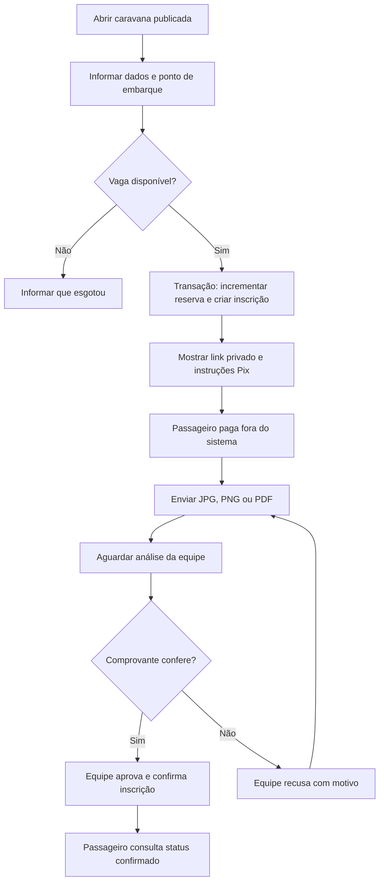

# Atividade: inscrição e pagamento

```mermaid
flowchart TD
  A[Abrir caravana publicada] --> B[Informar dados e ponto de embarque]
  B --> C{Vaga disponível?}
  C -- Não --> D[Informar que esgotou]
  C -- Sim --> E[Transação: incrementar reserva e criar inscrição]
  E --> F[Mostrar link privado e instruções Pix]
  F --> G[Passageiro paga fora do sistema]
  G --> H[Enviar JPG, PNG ou PDF]
  H --> I[Aguardar análise da equipe]
  I --> J{Comprovante confere?}
  J -- Sim --> K[Equipe aprova e confirma inscrição]
  J -- Não --> L[Equipe recusa com motivo]
  L --> H
  K --> M[Passageiro consulta status confirmado]
```
