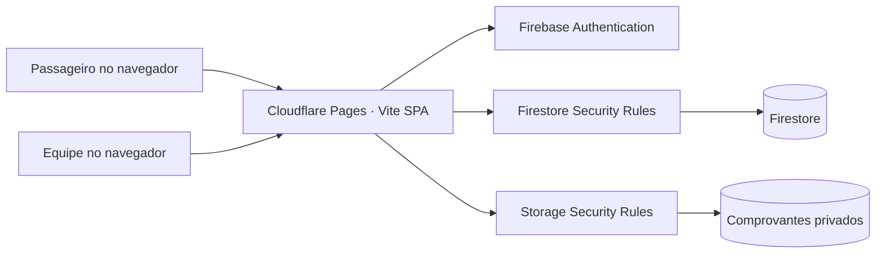

# Arquitetura

Caravana 77 é uma SPA React + TypeScript servida pelo Cloudflare Pages. Firebase Authentication identifica membros da equipe; Cloud Firestore guarda organizações, caravanas e inscrições; Firebase Storage recebe comprovantes privados. Não há API intermediária na V1.

Os documentos `admins/{uid}` são provisionados por uma pessoa com acesso administrativo confiável ao Firebase; as regras impedem autoinscrição de administradores. Cada registro administrativo aponta para uma única organização. Consultas administrativas sempre filtram por `organizationId`.

As reservas criam um identificador aleatório de 256 bits no navegador e, em uma transação Firestore, incrementam `reservedSeats` e criam a inscrição. A vaga fica ocupada desde o envio do formulário até a equipe cancelar a inscrição; uma recusa permite reenviar o comprovante e não libera a vaga automaticamente. Cancelar libera uma vaga em outra transação. As regras exigem que as duas mudanças da reserva apareçam juntas e que o limite não seja excedido. A página privada usa esse identificador como credencial de acesso: leitura direta é permitida, listagem pública não.

O comprovante só pode ser criado em `proofs/{organizationId}/{caravanId}/{registrationId}/...`, em formato JPG/PNG/PDF e até 8 MiB. A leitura é restrita a administradores da organização. Aprovação e check-in também exigem uma sessão administrativa autorizada.
