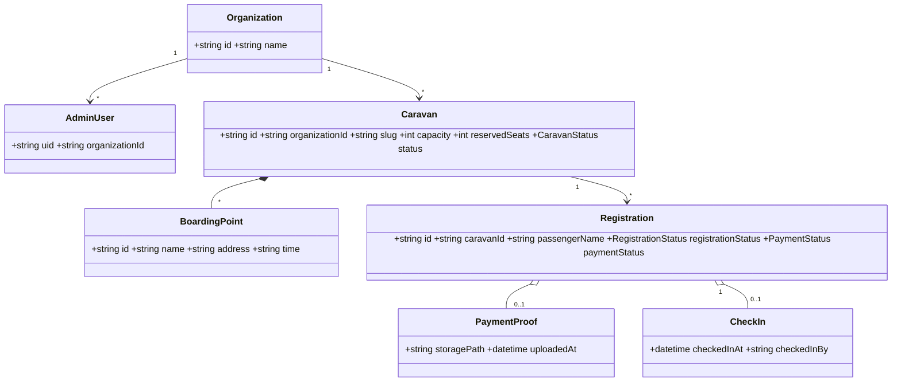

# Classes e entidades

```mermaid
classDiagram
  class Organization { +string id +string name }
  class AdminUser { +string uid +string organizationId }
  class Caravan { +string id +string organizationId +string slug +int capacity +int reservedSeats +CaravanStatus status }
  class BoardingPoint { +string id +string name +string address +string time }
  class Registration { +string id +string caravanId +string passengerName +RegistrationStatus registrationStatus +PaymentStatus paymentStatus }
  class PaymentProof { +string storagePath +datetime uploadedAt }
  class CheckIn { +datetime checkedInAt +string checkedInBy }
  Organization "1" --> "*" AdminUser
  Organization "1" --> "*" Caravan
  Caravan "1" *-- "*" BoardingPoint
  Caravan "1" --> "*" Registration
  Registration "1" o-- "0..1" PaymentProof
  Registration "1" o-- "0..1" CheckIn
```

FAQ e avisos são dados embutidos na caravana nesta V1. Os tipos TypeScript estão em `src/lib/types.ts`.
