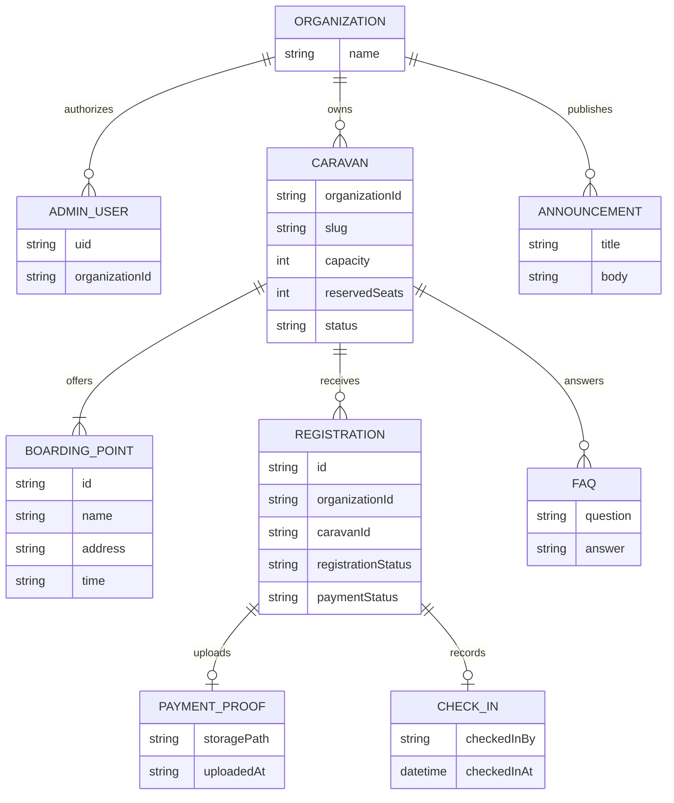

# Modelo de dados

Implementação: `admins/{uid}` liga a conta a `organizationId`; `organizations/{organizationId}` guarda metadados; `caravans/{caravanId}` guarda a caravana e os pontos/FAQ/avisos como listas ordenadas; `registrations/{registrationId}` guarda a inscrição, estado financeiro e campos de check-in; os comprovantes ficam em Storage e a inscrição guarda `proofPath`. Esse modelo mantém o isolamento multi-organização nas regras e evita expor coleções pessoais a consultas públicas.
