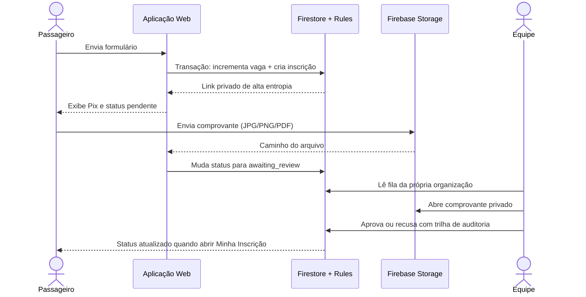

# Sequência de pagamento

```mermaid
sequenceDiagram
  actor P as Passageiro
  participant UI as Aplicação Web
  participant DB as Firestore + Rules
  participant S as Firebase Storage
  actor A as Equipe
  P->>UI: Envia formulário
  UI->>DB: Transação: incrementa vaga + cria inscrição
  DB-->>UI: Link privado de alta entropia
  UI-->>P: Exibe Pix e status pendente
  P->>S: Envia comprovante (JPG/PNG/PDF)
  S-->>UI: Caminho do arquivo
  UI->>DB: Muda status para awaiting_review
  A->>DB: Lê fila da própria organização
  A->>S: Abre comprovante privado
  A->>DB: Aprova ou recusa com trilha de auditoria
  DB-->>P: Status atualizado quando abrir Minha Inscrição
```
