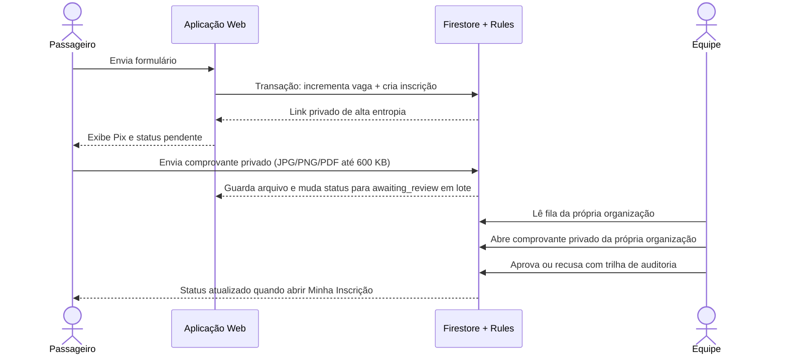

# Sequência de pagamento

```mermaid
sequenceDiagram
  actor P as Passageiro
  participant UI as Aplicação Web
  participant DB as Firestore + Rules
  actor A as Equipe
  P->>UI: Envia formulário
  UI->>DB: Transação: incrementa vaga + cria inscrição
  DB-->>UI: Link privado de alta entropia
  UI-->>P: Exibe Pix e status pendente
  P->>DB: Envia comprovante privado (JPG/PNG/PDF até 600 KB)
  DB-->>UI: Guarda arquivo e muda status para awaiting_review em lote
  A->>DB: Lê fila da própria organização
  A->>DB: Abre comprovante privado da própria organização
  A->>DB: Aprova ou recusa com trilha de auditoria
  DB-->>P: Status atualizado quando abrir Minha Inscrição
```
