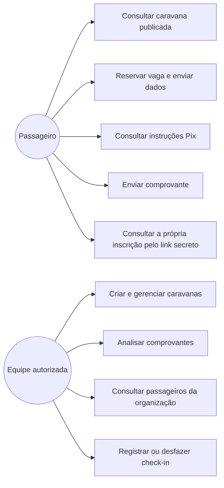

# Casos de uso

```mermaid
flowchart LR
  passenger((Passageiro)) --> browse[Consultar caravana publicada]
  passenger --> reserve[Reservar vaga e enviar dados]
  passenger --> pay[Consultar instruções Pix]
  passenger --> proof[Enviar comprovante]
  passenger --> own[Consultar a própria inscrição pelo link secreto]
  admin((Equipe autorizada)) --> manage[Criar e gerenciar caravanas]
  admin --> review[Analisar comprovantes]
  admin --> passengers[Consultar passageiros da organização]
  admin --> checkin[Registrar ou desfazer check-in]
```

O sistema não inicia cobranças: o pagamento ocorre fora dele por Pix. Enviar um comprovante não altera o pagamento para aprovado.
